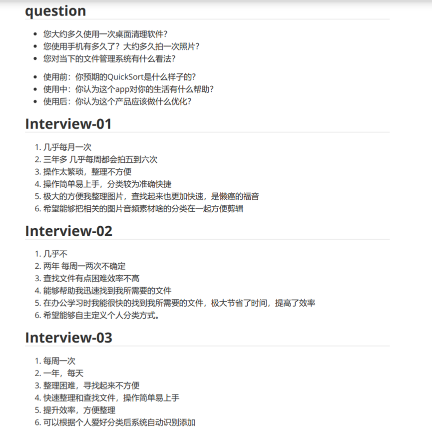
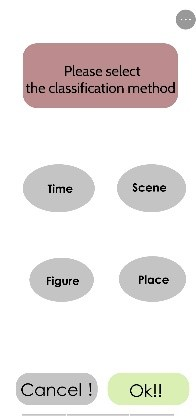
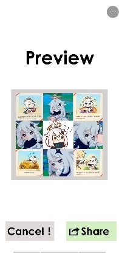

# The design of QuickSort

*QuickSort is a mobile APP in which users can sort off files in their own mobile phones fast and easily. In this report below, you would see the design flow of QuickSort with us developers and designers.*

## Introduction

QuickSort is an APP with a strong AI system, designed for those who are too busy to deal with files or mobile phone starters. Users enter this APP, select a proper way or the default configuration, and simply touch the “OK” button, the chosen files would be clearly classified with a rule that was previously selected. Using our app, users would find it pleasant to sort and find files. We believe that the time the APP published would be revolutionary for it can sharply decrease users’ wasted time in finding proper files.

## Choosing Design Topic

   Our design topic is designing an APP for sorting files as quickly as possible. In a brief discussion, we came upon this idea when a member in our group said that finding specific photo(s) in a mobile phone is difficult and time-wasting. With the initial thought, we decided to design an APP to make photos to be sorted and found easily. After that, another member pointed out that the APP should include not only functions in pictures-sorting, but also functions in files-sorting. Finally, we came to an agreement in design topic.

## Users Analysis

  After selecting our design topic, we needed to imagine our target users. Luckily, it’s not very hard. We immediately reached out to the answer that college students who are busy and middle-aged people who are not familiar with smart phone would often use our APP. However, we still don’t know how would they use it, so we analyzed our users again, thinking their using habits and actual needs, which can be interpreted as our **USERS ANALYSIS**.

First, we created two **PERSONAS** for two kinds of typical users, named as Qingqing and Auntie. Next, we had a long discussion to analyze their using ways and needs to construct the **EMPATHY MAPS** respectively. Thanks to the personas and empathy maps, we were able to learn more about our users, and design QuickSort more suitable for them. Then, we conducted some interviews with our friends, schoolmates, roommates, etc. to get their minds and expectations about our APP. Finally, with personas and interview results, we built an **AFFINITY MAP** to conclude the users’ wants and needs.

### Personas and Empathy Maps

We built two personas to emulate our users. And we named them as Qingqing and Auntie.

Qingqing is a normal college student, pursuing for efficient and avoiding troubles. He wants to sort off files quickly, but afraid of losing safety of privacy. His persona and empathy map are shown below.

Auntie is a middle-aged woman, whose son is in remote college. She often travels and takes pictures, but she doesn’t know how to sort off due to her few knowledges of mobile phone. Her persona and empathy map are shown below.

### Interview

At this stage, we made a questionnaire, and let three of our classmates answer it. Here are the questionnaire and answers.

The result reminded us to set a simple UI, in order to give a better using experience. Also, “efficiency” became a key word of answers, which means our APP must be quick enough to ensure the core competence. What’s more, self-designing function should be added to our APP.

### Affinity Map

   According to personas and interview results, we finally built an affinity map at this stage. The affinity map is shown below.

## Ideate

To have a better view that whether our APP meets the needs of users, firstly, we retried to explore the characteristics of the APP, which turned out to be fast sorting and finding, user-defined sorting, and seeking the best. In addition, with the help of our guidance teacher, we came to an agreement that we should give some suitable templates and composing ideas when users choosing pictures to publish on Circle of Friends or other social platforms. 

Using the features identified above, we designed several small stories to emulate the users’ feelings as much as possible, and we also made a simple storyboard for one of them.

The storyboard above showed a college student using QuickSort to find corresponding pictures to post on Circle of Friends when travelling out with friends.

According to our user stories had already made, we got a roughly speculating on our users’ needs, and we began to design a specific flowchart, in which we mainly kept a principle that our APP should be fast and convenient, expecting users to use our APP easily. 

With the flowchart made, we started to think about the specific UI design of our APP. Firstly, we identified that being simple should be the core of our APP, made the following prototype with the inspiration of Auntie, one of our personas. 

 

 

 

## User Flow

We designed the user flow for each function in our APP, showing the sequence of operation.

**Classification**

 

**Custom classification**

**Moments**

## Prototype Design

   Finally, we designed a prototype using Figma. Here is the [link](https://www.figma.com/proto/tOcIoZ81jFkkyyAn6Nw4ie/prototype?page-id=0%3A1&node-id=20%3A11&viewport=423%2C489%2C0.3281521201133728&scaling=scale-down&starting-point-node-id=20%3A11&show-proto-sidebar=1) of our final prototype.

## Feedback

To understand what our users treat our APP, we made a survey to collect feedbacks of them and conducted a discussion with results of the survey. 

### Feedback for Ideate

The survey of users enabled us to preliminarily conceive our APP and complete the preliminary template design, so we could use it to further improve our design.

In this survey, we gave users a brief introduction of our APP and let them try to completely use its functions to give real feedback.

And here are some of their feedbacks:

1. Interfaces are too simple to attract users in the first time, unable to make an impression on them.

2. They worry about their privacy safety when sorting files like pictures.

3. Although sorting is of great help to people, the current sorting method is too simple to meet the needs of some users.

 

From the feedback of users, we can draw a conclusion that currently users have high requirements for visual effects, privacy is still the focus of attention and people have high requirements for diversity of sorting. These issues were anticipated in the early time of the design, but we didn't provide the users with enough signifiers to indicate them.

 

Firstly, regarding the interface, we decided to add an interface beautification option on the home page, which will automatically redirect you to setting page. Cause everyone has different preferences for interfaces, we can't use one to satisfy everyone's needs, which is unrealistic. In the interface beautification page, we give users a great number of page choices. Users can select a best choice with their own preferences in our given interface beautification options. This page also has a searching function to help users quickly find the desired beautification page.

Secondly, when users starting the APP for the first time, we will add a privacy notice page, which is not lengthy legal terms, but with some simple illustrations to tell users their privacy is absolutely guaranteed, and they have the right to protect the safety of their own privacy. We also do not take the initiative to access all the user information, unless users allows it when sorting files. Also, we will not reveal even the most general information. Furthermore, the system will automatically remind the user when it detects that the selected picture may be suspected to involve privacy, in case that users accidentally disclose the privacy.

As for the problem that the current sorting method is too simple, that's because we can only use some samples for customers' tests at present. The most important thing for our current tests is to show its main functions to users, so we only provide a few common sorting methods, which is not equal to that we can only provide these sorting methods. When our further technology achieved, we will successively launch more targeted sorting methods for users. In addition, we also imagine that we will eventually provide the function of a custom sorting method, which will be defined by users and realized by the system so as to meet the needs of users in all aspects to the greatest extent.

### Feedback for Prototype

After we further improved our template, we had another discussion in the group and conducted a survey of users' experience again, so that users could give us new feedback on our APP to help us realize the design as soon as possible. Then we asked them to give feedback on our improved template and score it on a range of 1 to 5 (5 is the highest score). This time, the users were more satisfied and most of them gave a score of 4 or 5, which shows that our product design is OK. Based on the feedback from users, we can draw a conclusion that our APP has a simple and clear design style, simple and easy to use function operation, and high accuracy. However, some details in our APP need to be marked to make users feel at ease and comfortable. Thus, we will continue to improve our APP.

## Know more about us

Here's a link to our video

[Video](https://www.bilibili.com/video/BV1aU4y1H7X2)

